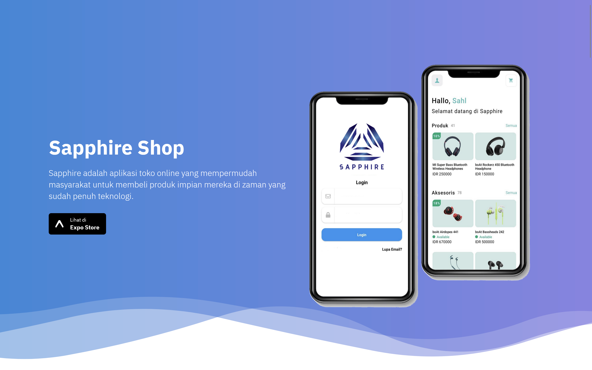

<!-- PROJECT LOGO -->
<br />
<div align="center">
  <a href="">
    
  </a>

  <h3 align="center">Cikini's best app</h3>

  <p align="center">
    Sapphire, trusted cikini's app
    <br />
  </p>
</div>


<!-- TABLE OF CONTENTS -->
<details>
  <summary>Table of Contents</summary>
  <ol>
    <li>
      <a href="#about-the-project">About The Project</a>
      <ul>
        <li><a href="#built-with">Built With</a></li>
      </ul>
    </li>
    <li>
      <a href="#getting-started">Getting Started</a>
      <ul>
        <li><a href="#prerequisites">Prerequisites</a></li>
        <li><a href="#installation">Installation</a></li>
      </ul>
    </li>
    <li><a href="#license">License</a></li>
    <li><a href="#contact">Contact</a></li>
  </ol>
</details>


<!-- ABOUT THE PROJECT -->
## About Sapphire


Sapphire Shop is a mobile ecommerce app built with React Native. Users can browse products, add them to a cart, and purchase them securely.

Key Features:
* Browse products by category.
* Search for products.
* View product details.
* Add/remove products to cart
* Change product quantities in cart
* Apply coupons during checkout
* Native mobile experience for iOS and Android


### Built With

[]()
</br>
[]()
</br>
[]()

### Prerequisites

Before you begin, ensure you have the following components installed on your system:

  1. Node js
  2. Expo CLI

### Installation


1. Clone the repo
   ```sh
   https://github.com/xanaqwert/Sapphire-shop-landing-page
   ```
2. Navigate to the project directory:
   ```sh
   cd Sapphire-shop-landing-page
   ```
3. Install dependencies:
   ```sh
   npm or yarn (if u use yarn) install
   ```
4. Start on localhost:
   ```sh
   Expo start
   ```


<!-- CONTRIBUTING -->
## Contributing

Pull requests are welcome! Feel free to open an issue for any bugs or desired features.

contribute by following these steps:

1. Fork the Project
2. Create your Feature Branch (`git checkout -b feature/AmazingFeature`)
3. Commit your Changes (`git commit -m 'Add some AmazingFeature'`)
4. Push to the Branch (`git push origin feature/AmazingFeature`)
5. Open a Pull Request

Don't forget to give the project a star if you find it helpful! Thanks for your support!


<!-- LICENSE -->
## License

License:

This project is licensed under the LICENSE.txt - see the LICENSE file for details.

<!-- CONTACT -->
## Contact

Muhammad Sahl Harits - [@xanaqwert](https://twitter.com/xanaqwert) - sahlrangers@gmail.com

<p align="right">(<a href="#readme-top">back to top</a>)</p>
